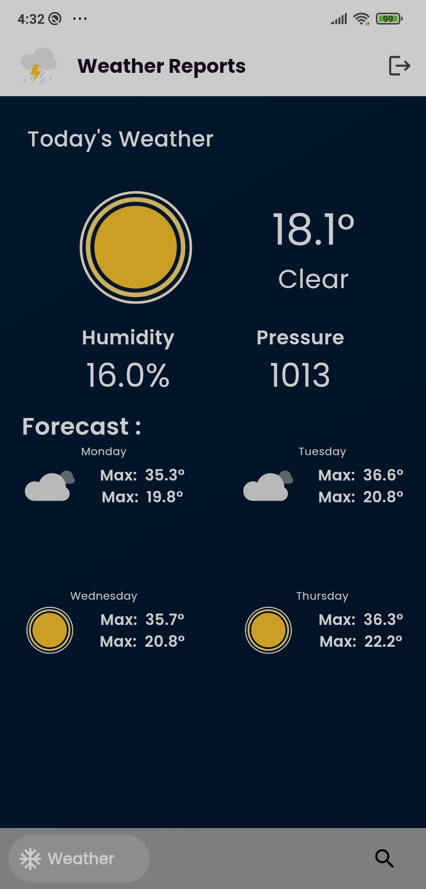
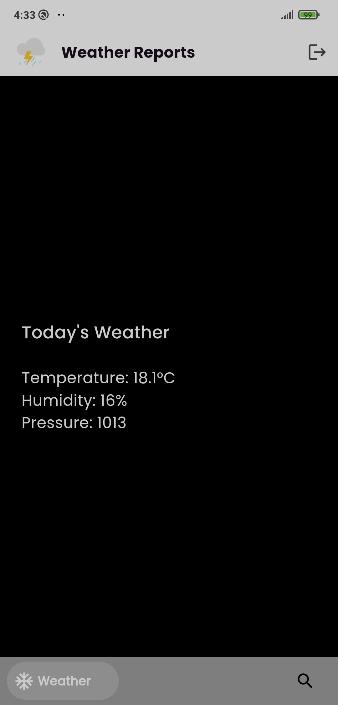
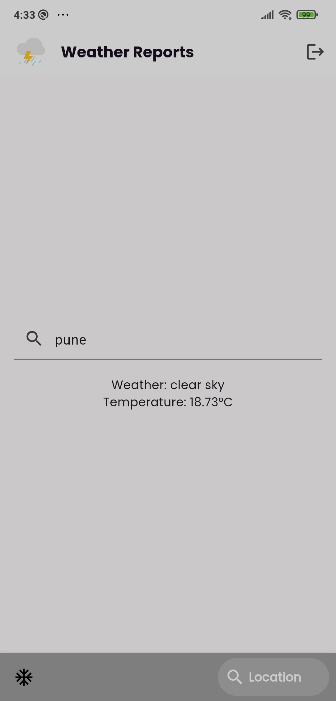
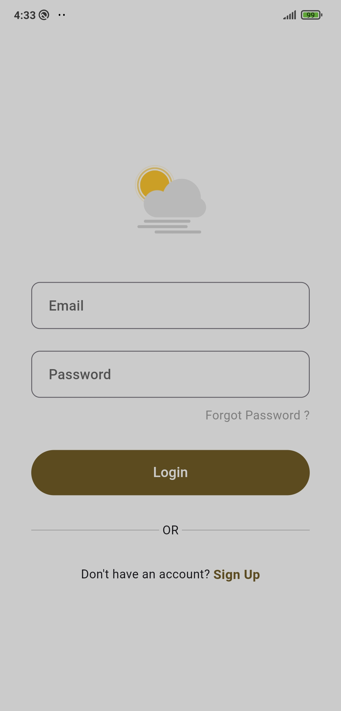
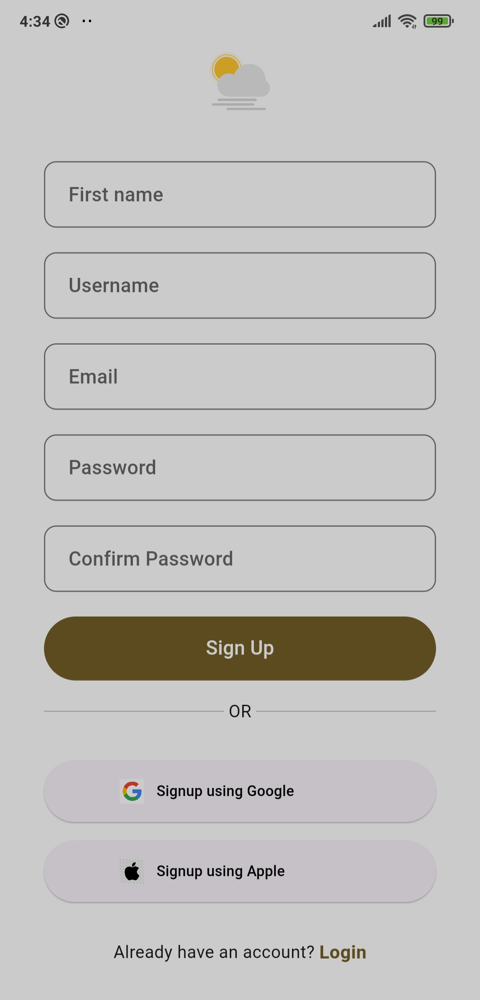
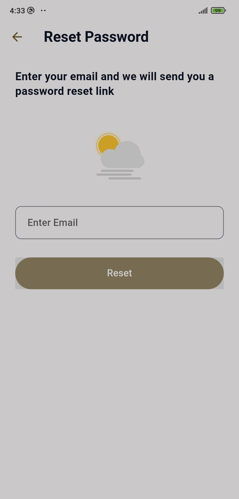

# Weather App

This Weather App allows users to view current weather information and forecasts for locations, as well as search for weather information for specific locations. It also includes Firebase authentication for login, sign up, and password reset functionalities.

## Screenshots

|  |  |  |  |
| :------------------------------: | :---------------------------------: | :--------------------------: | :----------------------------------: |
|       *Splash Screen*            |         *Current Weather*          |       *Forecast*             |         *Search Location*           |

|  |  |  |
| :--------------------: | :----------------------: | :---------------------------------: |
|        *Login*         |         *Sign Up*         |       *Forgot Password*             |

## Features

- **Splash Screen**: Upon launching the app, users are greeted with a splash screen that appears while the app initializes.

- **Current Weather Page**: This page displays the current weather information, including temperature, humidity, and pressure for the current location. It also provides a forecast for the next four days.

- **Search Location Page**: Users can search for weather information for specific locations using this page. They can enter the name of the location, and the app will display the weather and temperature for that location.

- **Authentication Screens**: The app includes screens for login, sign up, and password reset using Firebase authentication.

## Usage

1. **Splash Screen**: The app displays a splash screen during initialization.

2. **Current Weather Page**: Users can view the current weather information and forecast for the next four days on this page.

3. **Search Location Page**: Users can search for weather information for specific locations by entering the location's name in the search bar and pressing the search button.

4. **Authentication Screens**: Users can log in, sign up, and reset their password using the provided authentication screens.

## Technologies Used

- Flutter: Cross-platform framework for building mobile applications.
- OpenWeatherMap API: Used to fetch weather data.
- Firebase Authentication: Used for user authentication.
- Other dependencies: Google Fonts, HTTP package for API requests, etc.

## Installation

1. Clone the repository:
   ```bash
   git clone https://github.com/your-username/weather-app.git

   cd weather-app
   flutter pub get
   flutter run
